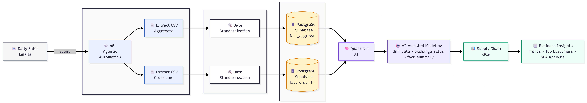

# Architecture Overview

This folder contains the **high-level architecture diagram** for the AI-agentic supply chain analytics system.

The diagram illustrates how daily sales data flows from **email ingestion to business insights**, using agentic automation, cloud storage, and AI-assisted analytics.

---

## 📊 Workflow Summary

**Daily Sales Emails → n8n → PostgreSQL (Supabase) → Quadratic AI → Supply Chain Insights**

### Key Stages
- **Email Trigger**  
  Daily sales CSV files are received via email and act as the event trigger.

- **Agentic Automation (n8n)**  
  n8n monitors the inbox, extracts CSV attachments, and processes:
  - Aggregate order data
  - Order line–level data

- **Data Standardization**  
  Dates are normalized to ISO format (`YYYY-MM-DD`) using n8n expressions backed by Luxon to ensure database compatibility.

- **Cloud Storage (PostgreSQL on Supabase)**  
  Cleaned data is ingested into separate fact tables:
  - `fact_aggregate` (order-level)
  - `fact_order_line` (line-level)

- **AI Analytics (Quadratic)**  
  Quadratic connects directly to PostgreSQL to perform AI-assisted modeling, including:
  - Date dimension generation
  - Exchange rate enrichment
  - Creation of a denormalized `fact_summary`

- **Business KPIs & Insights**  
  The final layer focuses on supply chain reliability KPIs (OTIF, Fill Rates) and business insights such as customer performance and SLA analysis.

---

## 🖼️ Architecture Diagram

---

## 📌 Purpose of This Diagram

This diagram is intended to:
- Communicate the **end-to-end system design**
- Highlight the role of **agentic automation**
- Show how AI is applied **after** proper data modeling
- Provide a quick mental model for reviewers and stakeholders
